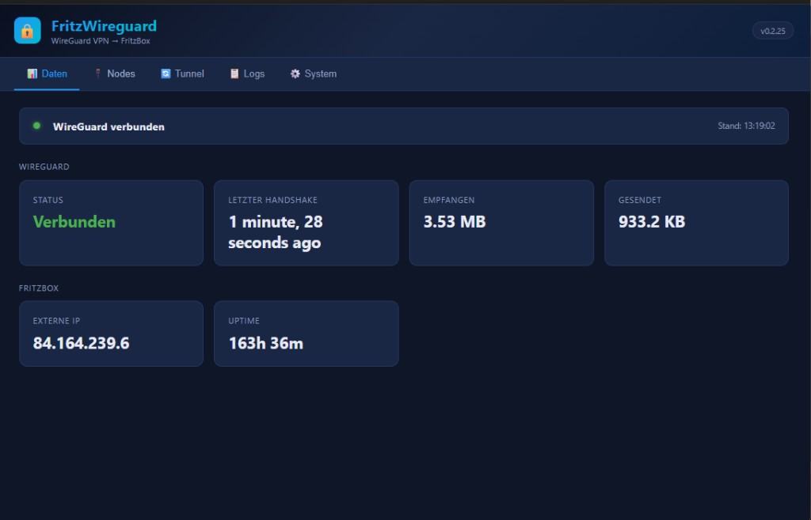
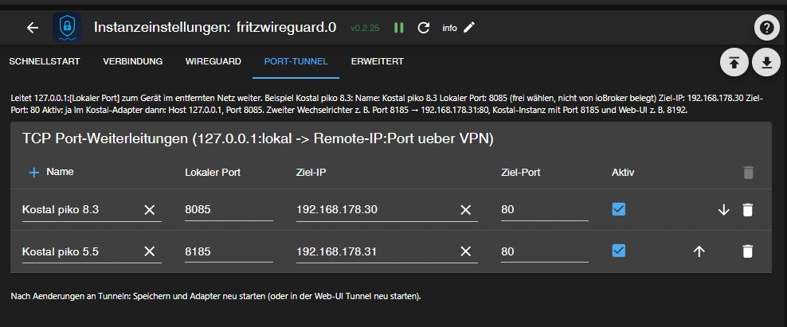
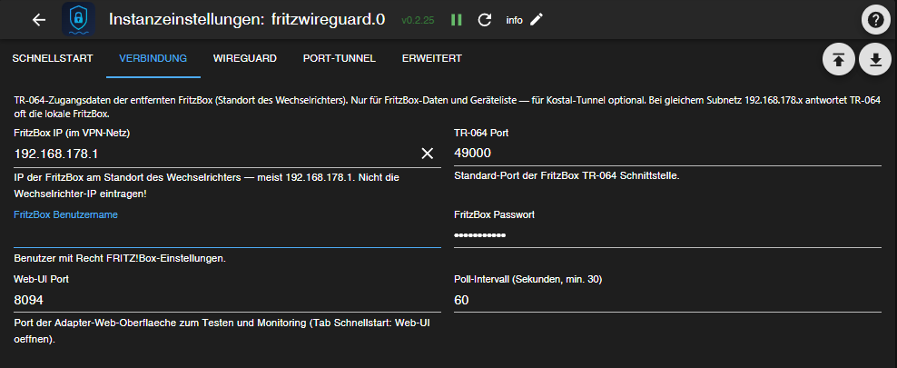
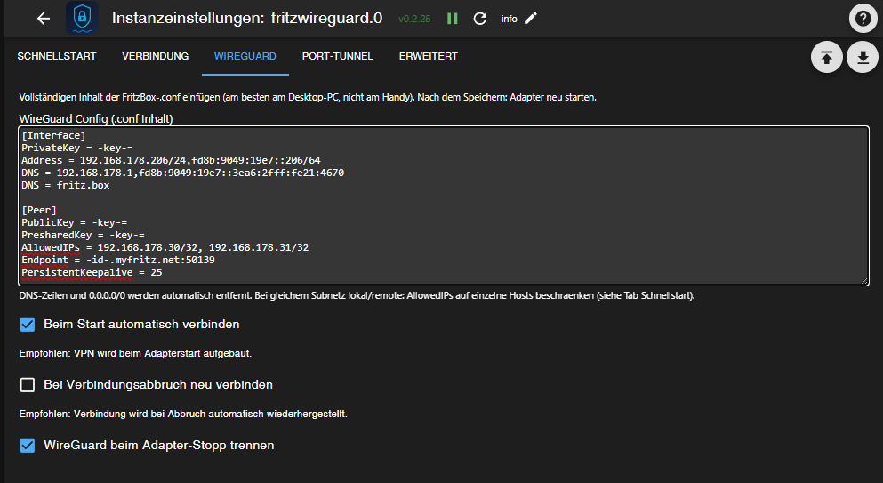
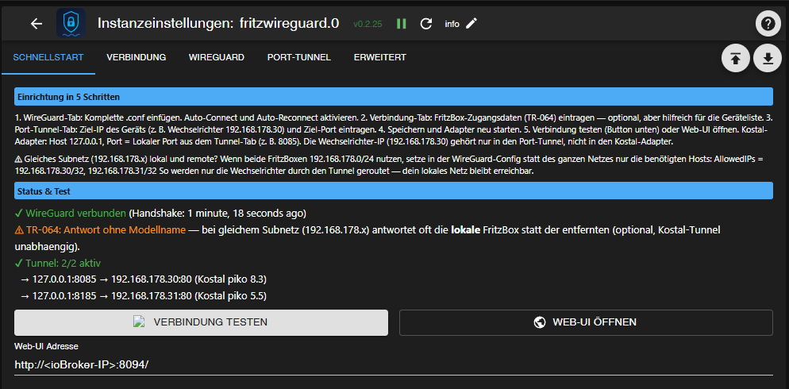
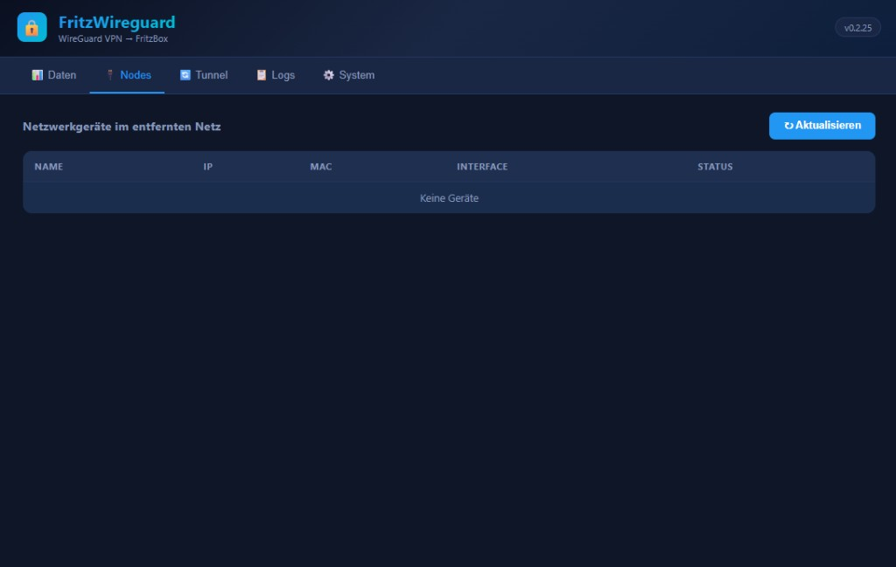
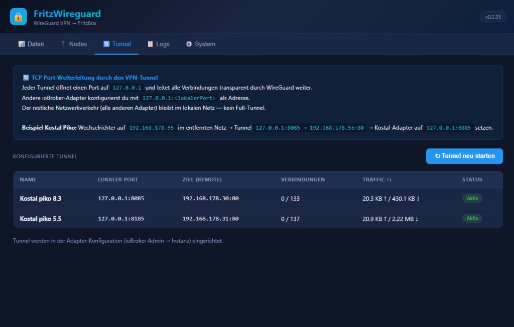
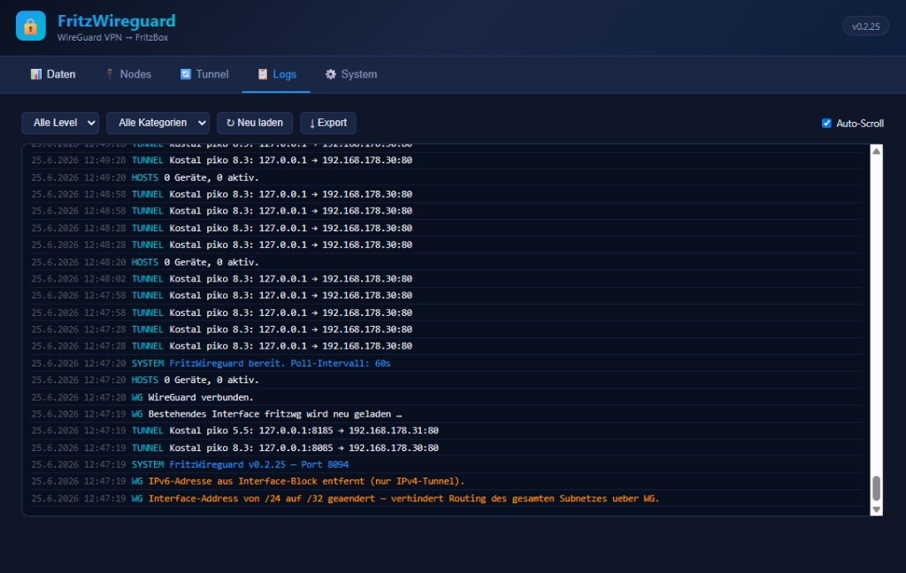
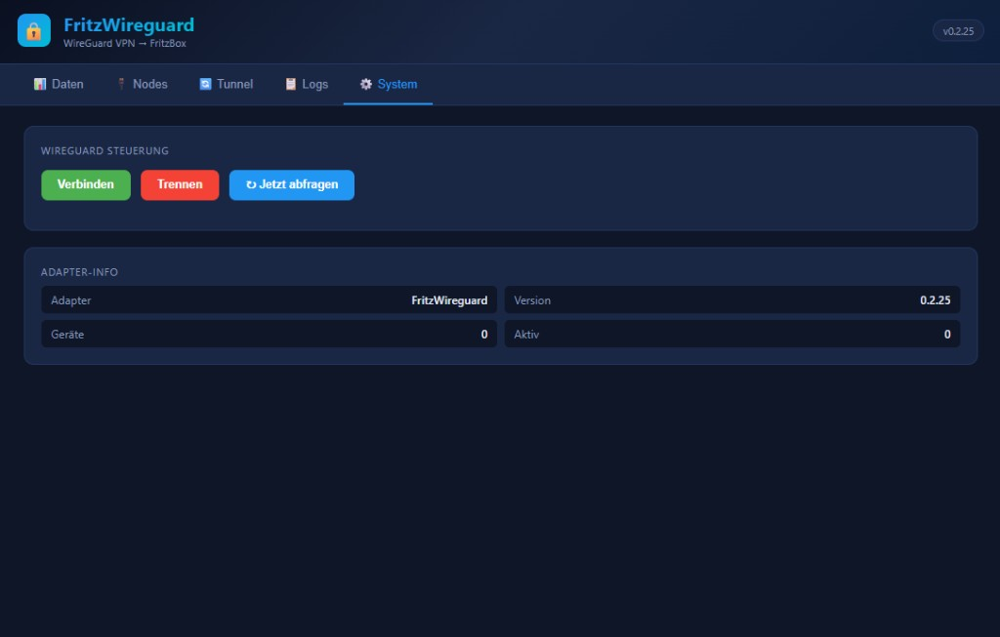

# ioBroker FritzWireguard Adapter

[](https://github.com/MPunktBPunkt/iobroker.fritzwireguard/releases)
[](./LICENSE)
[](https://nodejs.org)
[](https://github.com/MPunktBPunkt/iobroker.fritzwireguard)

Verbindet ioBroker via **WireGuard VPN** mit einer entfernten FritzBox. Der Adapter stellt
Netzwerkgeräte, WAN-Status und FritzBox-Infos als ioBroker-Datenpunkte bereit und ermöglicht
über einen integrierten **TCP Tunnel Manager**, einzelne Adapter selektiv mit Geräten im
entfernten Netz zu verbinden — ohne den restlichen Traffic anderer Adapter zu beeinflussen.

[](https://www.paypal.com/donate/?business=martin%40bchmnn.de&currency_code=EUR)

---

## Überblick

| Komponente | Adresse (Beispiel) |
|------------|-------------------|
| FritzWireguard Web-UI | `http://<ioBroker-IP>:8094/` |
| Kostal PIKO 8.3 (Instanz `.0`) | Adapter: `127.0.0.1:8085` · Web-UI: `:8092` |
| Kostal PIKO 5.5 (Instanz `.1`) | Adapter: `127.0.0.1:8185` · Web-UI: `:8192` |



---

## Features

* **WireGuard VPN** – automatischer Verbindungsaufbau via `wg-quick`, Reload bei Config-Wechsel
* **Config-Sanitizer** – entfernt DNS, Full-Tunnel, IPv6 und `/24`-Addressen; schränkt `AllowedIPs` auf Tunnel-Hosts ein
* **TR-064 Integration** – WAN-IP, Uptime, Modell, Firmware (optional; bei gleichem Subnetz oft lokale FritzBox)
* **TCP Tunnel Manager** – `127.0.0.1:<Port>` → Remote-IP:Port über VPN; mehrere Tunnel parallel
* **Web-UI** – Tabs Daten, Nodes, Tunnel, Logs, System
* **Schnellstart im Admin** – Live-Status, Verbindungstest, Web-UI-Link
* **Auto-Reconnect** – erkennt fehlenden Handshake und verbindet neu

---

## Voraussetzungen

### Auf dem ioBroker-Host (Linux)

```bash
sudo apt update && sudo apt install -y wireguard

echo "iobroker ALL=(ALL) NOPASSWD: /usr/bin/wg-quick" \
  | sudo tee /etc/sudoers.d/iobroker-wireguard
echo "iobroker ALL=(ALL) NOPASSWD: /usr/bin/wg" \
  | sudo tee -a /etc/sudoers.d/iobroker-wireguard
sudo chmod 440 /etc/sudoers.d/iobroker-wireguard
```

### FritzBox (entfernter Standort)

1. **WireGuard VPN:** Internet → Freigaben → VPN (WireGuard) → Client anlegen → `.conf` exportieren
2. **TR-064 (optional):** Heimnetz → Netzwerk → Heimnetzfreigaben → „Zugriff für Anwendungen zulassen"
3. **Benutzer** mit Recht „FRITZ!Box-Einstellungen" für TR-064

---

## Installation

```bash
iobroker url https://github.com/MPunktBPunkt/iobroker.fritzwireguard
iobroker add fritzwireguard
```

---

## Einrichtung (Admin)

> Am **Desktop-PC** im ioBroker-Admin einrichten — die WireGuard-Config ist mehrzeilig.

### Tab: Schnellstart

Checkliste, Live-Status und Buttons **Verbindung testen** / **Web-UI öffnen**.



**Erfolgreicher Test zeigt:**

* WireGuard verbunden (mit Handshake-Zeit)
* Tunnel: 2/2 aktiv (Beispiel mit zwei Wechselrichtern)
* TR-064-Warnung bei gleichem Subnetz ist **normal** und blockiert Kostal nicht

### Tab: Verbindung

TR-064-Zugangsdaten der **entfernten** FritzBox — optional für Geräteliste und WAN-Daten.



| Einstellung | Beispiel | Hinweis |
|-------------|----------|---------|
| FritzBox IP | `192.168.178.1` | FritzBox am **Remote-Standort**, nicht Wechselrichter-IP |
| TR-064 Port | `49000` | Standard |
| Web-UI Port | `8094` | Port dieser Adapter-Web-Oberfläche |
| Poll-Intervall | `60` | Minimum 30 Sekunden |

### Tab: WireGuard

Komplette `.conf` der FritzBox einfügen. Der Adapter bereinigt automatisch:

* `DNS =` Zeilen
* `0.0.0.0/0` und `::/0` in AllowedIPs
* IPv6-Adressen
* `Address …/24` → `/32` (verhindert Routing-Lockout bei gleichem Subnetz)



**AllowedIPs bei gleichem Subnetz** (lokal und remote beide `192.168.178.x`):

```ini
AllowedIPs = 192.168.178.30/32, 192.168.178.31/32
```

Nur die **Wechselrichter-IPs** eintragen — **nicht** `192.168.178.0/24` und **nicht** die lokale FritzBox `.1` (sonst lokales Netz/SSH blockiert).

| Checkbox | Empfehlung |
|----------|------------|
| Beim Start automatisch verbinden | ✅ |
| Bei Verbindungsabbruch neu verbinden | ✅ |
| WireGuard beim Adapter-Stopp trennen | ✅ |

### Tab: Port-Tunnel

Hier legst du die **lokalen Ports** fest — frei wählbar, solange sie auf dem ioBroker-Host frei sind.



| Name | Lokaler Port | Ziel | Kostal-Adapter |
|------|--------------|------|----------------|
| Kostal piko 8.3 | **8085** | `192.168.178.30:80` | `127.0.0.1` / Port **8085** / Web-UI **8092** |
| Kostal piko 5.5 | **8185** | `192.168.178.31:80` | `127.0.0.1` / Port **8185** / Web-UI **8192** |

**Warum ein lokaler Port?**

```
[Kostal-Adapter] → 127.0.0.1:8085 → [Tunnel] → [VPN] → 192.168.178.30:80
```

Der Kostal-Adapter spricht immer `127.0.0.1` an. Der Tunnel leitet transparent weiter.
Die **Wechselrichter-IP gehört nur in den Port-Tunnel**, nicht in den Kostal-Adapter.

**Ports nicht belegen:** u. a. `8094` (FritzWireguard), `8092`/`8192` (Kostal-Web-UIs),
`8095` (andere Adapter), `8080`/`8081` (ioBroker-Admin).

Nach Änderungen: **Speichern** → Adapter **neu starten** (oder Web-UI → Tunnel neu starten).

---

## Web-UI

Browser: `http://<ioBroker-IP>:8094/`

### Tab: Daten

WireGuard-Status, Handshake, empfangene/gesendete Bytes, FritzBox WAN-Infos.


### Tab: Nodes

Geräteliste im entfernten Netz (via TR-064). Bei gleichem Subnetz oft leer — **optional**.



### Tab: Tunnel

Konfigurierte Tunnel mit Verbindungszähler und Traffic pro Tunnel.



### Tab: Logs

Filter nach Level/Kategorie; Kategorien `WG`, `TUNNEL`, `SYSTEM`, `HOSTS`.



### Tab: System

WireGuard verbinden/trennen, Sofort-Poll, Adapter-Info.



---

## Verbindung testen

### Im ioBroker-Admin

1. Tab **Schnellstart** → **Verbindung testen**
2. Grün: WireGuard + Tunnel OK
3. Orange TR-064: bei gleichem Subnetz erwartbar

### Per SSH

```bash
sudo wg show fritzwg
curl -s -o /dev/null -w '%{http_code}\n' http://127.0.0.1:8085/
curl -s -o /dev/null -w '%{http_code}\n' http://127.0.0.1:8185/
```

HTTP **401** = Wechselrichter antwortet (Auth nötig). **000**/Timeout = Gerät nicht erreichbar.

### ioBroker-Datenpunkte

```
fritzwireguard.0.info.connection     → true
fritzwireguard.0.wireguard.status    → "connected"
fritzwireguard.0.wireguard.handshake → z. B. "1 minute ago"
```

---

## Fehlerbehebung

| Symptom | Ursache | Lösung |
|---------|---------|--------|
| `fritzwg already exists` | Altes Interface nach Config-Wechsel | v0.2.24+: Adapter neu starten (lädt Interface neu) |
| SSH/Ping zum ioBroker weg | `AllowedIPs` zu breit oder `/24`-Address | Nur `/32` der Wechselrichter; Adapter-Sanitizer prüfen |
| Handshake „nie" | Falsche/veraltete `.conf` | Neue Config von Remote-FritzBox exportieren |
| TR-064 ohne Modellname | Gleiches Subnetz → lokale FritzBox | Optional ignorieren; Kostal-Tunnel unabhängig |
| Kostal Timeout | Falsche IP im Kostal-Adapter | Kostal: `127.0.0.1` + **Tunnel-Port**, nicht Remote-IP |
| Nodes leer | TR-064 erreicht Remote-FritzBox nicht | Normal bei Subnetz-Konflikt; Tunnel reicht für Kostal |
| Web-UI 0 B trotz Traffic | Alte Version | v0.2.25+: KiB/MiB-Parsing + Live-Refresh |

**Debug-Log:** `/tmp/fritzwireguard-debug.log`

---

## REST-API

| Methode | Endpunkt | Beschreibung |
|---------|----------|--------------|
| GET | `/api/status` | WG-, FritzBox- und Gerätestatus |
| GET | `/api/tunnels` | Tunnel mit Statistiken |
| POST | `/api/tunnels/restart` | Tunnel neu starten |
| GET | `/api/logs` | Log-Einträge |
| POST | `/api/connect` / `/api/disconnect` | VPN steuern |
| POST | `/api/poll` | Sofort-Poll |

---

## Update

```bash
iobroker url https://github.com/MPunktBPunkt/iobroker.fritzwireguard
iobroker upload fritzwireguard
iobroker restart fritzwireguard.0
```

---

## Changelog

### 0.2.25 (2026-06-25)
* **Fix:** Web-UI WG-Byte-Statistik (KiB/MiB), Live-Refresh bei Tab-Wechsel
* **Fix:** Admin-Hilfetexte als Klartext; Test-Button-Icon `play_arrow`
* **Getestet:** Zwei Kostal-Wechselrichter parallel (8085 + 8185)

### 0.2.24 (2026-06-25)
* **Fix:** WG-Interface bei Config-Wechsel neu laden (`fritzwg already exists`)
* **Fix:** Verbindungsstatus erst mit Handshake; TR-064-Hinweis bei gleichem Subnetz

### 0.2.23 (2026-06-24)
* **Fix:** Interface-Address `/24` → `/32` (Routing-Lockout verhindern)

### 0.2.22 (2026-06-24)
* **Fix:** AllowedIPs ohne lokale FritzBox `.1`

### 0.2.21 (2026-06-24)
* **Fix:** WG-Interface-Name `fritzwg` (max. 15 Zeichen); `sudo -n` mit Vollpfaden

### 0.2.20 (2026-06-24)
* **Fix:** Method-Binding nach Lazy-Load (`this._version is not a function`)

### 0.2.19 (2026-06-24)
* **Fix:** `lib/adapter.js` erst in `onReady` laden — States-DB-Init-Hänger behoben

Weitere ältere Einträge siehe [GitHub Releases](https://github.com/MPunktBPunkt/iobroker.fritzwireguard/releases).

---

## Lizenz

MIT © MPunktBPunkt
